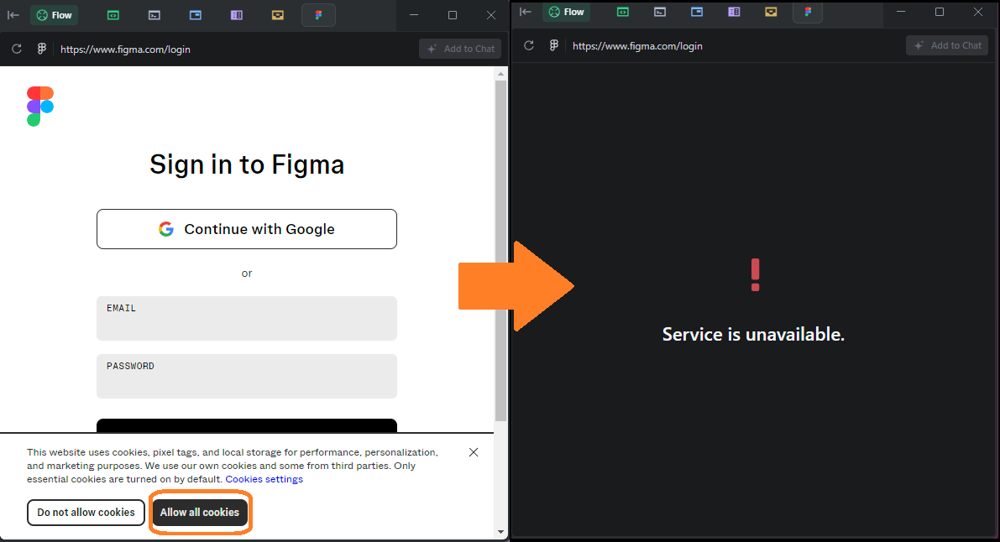

# Trae キャッシュ＆クッキー クリーナー

この PowerShell スクリプトは、Trae アプリのクッキーを削除し、必要に応じて以下の場所にあるストレージ／キャッシュもクリーンアップします。
- %APPDATA%\Trae
- %LOCALAPPDATA%\Trae

破損したクッキーや不整合なサイトデータが原因の問題（例：Trae のソロモードでの Figma ログイン／セッションの不具合）を解決するのに役立ちます。

## 本スクリプトが対処する一般的な問題

Trae（ソロモード）内で Figma にログインする際、クッキーバナー（"Allow all cookies"）を許可すると、セッションが壊れて「Service is unavailable.」と表示される黒い画面になることがあります。これは、Trae の組み込みブラウザに保存されたクッキーやサイトデータ（Local Storage、IndexedDB、パーティションキャッシュなど）が破損・不整合になっていることが原因です。

イメージ：



### スクリプトの効果
- 不整合／破損したログイン状態を保持してしまうクッキーファイルを削除します。
- 必要に応じて、Local Storage と IndexedDB を削除し、新しいセッションと競合しないようにします。
- 必要に応じて、組み込みブラウザが使用するキャッシュやパーティションデータをクリアします。

### 推奨手順
1. Trae を完全に終了します。
2. フルクリーンアップを実行します：
   ```powershell
   ./Clear-TraeCookies.ps1 -All
   ```
3. Trae を再起動し、Figma に再度ログインしてください。プロンプトが表示されたらクッキーを許可します。
4. 問題が続く場合は、`-Backup -All` でバックアップを取りつつ再度実行し、もう一度お試しください。バックアップを共有いただければ解析も可能です。

## 機能
- ロックされたファイルを避けるため、Trae のプロセスを停止
- すべてのプロファイルにあるクッキーファイル（Cookies と Cookies-journal）を削除
- オプションで、Local Storage、IndexedDB、Session Storage、各種キャッシュ（GPUCache、Code Cache、blob_storage、Service Worker、Cache、DawnCache）をクリーンアップ
- 削除前にファイル／ディレクトリをバックアップするオプション
- 事前確認のためのドライラン（dry‑run）モード

## 必要環境
- Windows（PowerShell 5.1+ または PowerShell 7+）

## 使い方
プロジェクトフォルダで PowerShell を開きます：

```powershell
Set-Location "c:\Users\danalec\Documents\src\traecachecleaner"
```

次のいずれかを実行します：

```powershell
# クッキーのみを削除
./Clear-TraeCookies.ps1

# 削除前にクッキーをバックアップ
./Clear-TraeCookies.ps1 -Backup

# すべて削除（クッキー + ストレージ + キャッシュ）
./Clear-TraeCookies.ps1 -All

# ドライラン：削除対象を確認
./Clear-TraeCookies.ps1 -WhatIf
```

スクリプト実行がブロックされる場合は、一時的にバイパスします：

```powershell
Set-ExecutionPolicy -Scope Process -ExecutionPolicy Bypass; ./Clear-TraeCookies.ps1 -All
```

## 注意事項
- クリーンアップ後は Trae を再起動し、必要に応じて再度サインインしてください。
- `-All` を使用するとサイトデータとキャッシュが削除され、セッションはクリアされます。
- バックアップは `%TEMP%/TraeCookiesBackup_yyyyMMdd_HHmmss/` に保存されます（カスタムパスを指定しない場合）。

## 削除対象
- クッキー：`Cookies`、`Cookies-journal`
- ストレージ（有効時）：`Local Storage`、`IndexedDB`、`Session Storage`
- キャッシュ（有効時）：`GPUCache`、`Code Cache`、`blob_storage`、`Service Worker`、`Cache`、`DawnCache`

## 免責事項
このスクリプトはアプリケーションデータを削除します。自己責任でご使用ください。必要に応じて、まず `-Backup` を利用して復元できるようにすることをおすすめします。
